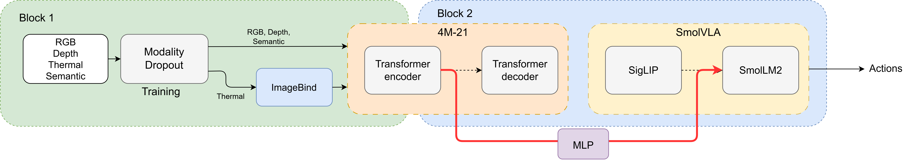

# Sensor-Robust Multimodal VLA via Modality-Dropout Adapter Training on SmolVLA

**CS-503 Visual Intelligence: EPFL, 2026**

*Alix Papadatos - Florian Tanguy - Mario Fernández - Tomas Garate Anderegg*

```bash
git clone --recurse-submodules <repo_url>
```

---
c.f: https://mfblanco.github.io/MultiSmolVLA/
## Overview

State-of-the-art Vision-Language-Action (VLA) models rely exclusively on RGB perception and suffer catastrophic performance degradation under sensor failure. We propose a training strategy that builds robustness by replacing SmolVLA's SigLIP encoder with the frozen **4M-21** multimodal encoder, bridged by a lightweight **MLP connector**, and trained under a **modality-dropout curriculum** to handle missing or corrupted sensors at inference time.

---

## Pipeline



**Block 1: Perception.** Four input modalities (RGB, depth, segmentation, thermal) pass through a modality-dropout layer during training. Thermal images are synthesized from RGB via ThermalGen and embedded through ImageBind into a representation compatible with 4M-21. The frozen 4M-21 encoder fuses all available modalities into a unified token sequence.

**Block 2: Action.** The 4M token sequence is projected into SmolLM2's embedding space via an MLP connector (LLaVA-1.5 style). SmolLM2, conditioned on text instructions and robot state tokens, drives the action expert to generate continuous action chunks.

---

## Method

### Architecture

| Component | Role | Trainable |
|---|---|---|
| ThermalGen | Synthesizes thermal image from RGB | no Frozen |
| ImageBind | Encodes thermal → 4M-compatible embedding | no Frozen |
| 4M-21 encoder | Fuses RGB + depth + seg + thermal → 196 token sequence | no Frozen |
| MLP connector | Projects 4M tokens (2048-dim) → SmolLM2 space (960-dim), pools 196→64 tokens | yes Stage 1 |
| SmolLM2 | Language-conditioned decoder, 16 layers | yes Stage 2 (LoRA) |
| Action expert | Flow-matching action chunk generator | yes Stage 2 (LoRA) |

### Training Strategy

**Stage 1: Connector alignment.** Train only the MLP connector with a per-token cosine distillation loss aligning 4M features to the SigLIP+connector target (i.e., the exact features SmolLM2 expects at inference). All other components frozen. The connector also reduces the token count from 196 to 64 via adaptive average pooling to match the original SigLIP output count.

**Stage 2: Robustness fine-tuning.** Fine-tune the pipeline with LoRA adapters on SmolLM2 under a modality-dropout curriculum. Each modality is independently zeroed or softly corrupted with probability p\_drop, increasing linearly from 0 to 0.5 over training.

### Modality Dropout

During training, each modality is independently corrupted before being passed to 4M-21. Three corruption types are used: Gaussian noise, motion blur, and centered black-square occlusion. This forces the model to fuse all available modalities and compensate for missing ones at inference time.

---

## Pretrained Models & Dataset

| Resource | HuggingFace Link | Description |
|---|---|---|
| Stage 1 checkpoint | [`TomasAnderegg/multismolvla-stage1-rgb-pertok`](https://huggingface.co/TomasAnderegg/multismolvla-stage1-rgb-pertok) | MLP connector after Stage 1 distillation (per-token cosine loss) |
| Stage 2 checkpoint | [`ftanguy/MultiSmolVLA-Robust`](https://huggingface.co/ftanguy/MultiSmolVLA-Robust) | Full pipeline after Stage 2 LoRA fine-tuning |
| Parquet dataset | [`TomasAnderegg/libero_10_thermal`](https://huggingface.co/datasets/TomasAnderegg/libero_10_thermal) | LIBERO-10 with RGB, depth, segmentation, thermal modalities |

---

## Dataset

We use the [`TomasAnderegg/libero_10_thermal`](https://huggingface.co/datasets/TomasAnderegg/libero_10_thermal) dataset on HuggingFace, derived from the [LIBERO benchmark](https://libero-project.github.io/), which provides aligned RGB, semantic segmentation, and depth map modalities. Thermal representations are synthetically generated from RGB using [ThermalGen](https://openreview.net/forum?id=o0JSYq1TQ4). The dataset can be downloaded automatically at training time (see `run_stage1_rgb.sh`).

---

## Evaluation

We evaluate on the **LIBERO-10** task suite (10 kitchen manipulation tasks), comparing our MultiSmolVLA pipeline against a vanilla SmolVLA baseline (RGB only, no dropout training).

---

## Key Files by Component

### MLP Connector Pipeline (core implementation)

| File | Role |
|---|---|
| `src/pipeline/connector.py` | MLP connector: Linear(2048→960) → GELU → Linear → LayerNorm + adaptive pool 196→64 tokens |
| `src/pipeline/encoder_4m.py` | 4M-21 encoder wrapper with optional depth/seg patch embedders |
| `src/pipeline/block2.py` | Block 2 module: wires 4M encoder + MLP connector + SmolVLA |
| `src/pipeline/full_pipeline.py` | End-to-end pipeline with all training losses (see below) |
| `src/pipeline/smolvla/custom_smolvla_policy.py` | Monkey-patches `embed_image()` in SmolVLMWithExpert to use 4M+MLP instead of SigLIP |
| `src/pipeline/smolvla/smolvla_wrapper.py` | SmolVLA module wrapper used by Block 2 |
| `src/pipeline/smolvla/configuration_smolvla.py` | SmolVLA config extended with `fourm_checkpoint`, `freeze_4m`, `freeze_mlp` flags |

### Stage 1: Connector Alignment (distillation)

| File | Role |
|---|---|
| `scripts/train_full_pipeline.py` | Main training entry : use with `--distill --no_block1 --freeze_4m --freeze_smolvlm --freeze_action_expert` |
| `scripts/train_block2.py` | Alternative entry,  use with `--distill_only --parquet` (distillation loss only, no action loss) |
| `scripts/run_stage1_rgb.sh` |  Run Stage 1 distillation |
| **Loss** | `full_pipeline.py:compute_distill_loss()` , per-token cosine between 4M+MLP output and SigLIP+connector output: `loss = 1 - cos_sim(MLP(4M(rgb)), embed_image(rgb))` |

### Stage 2: LoRA Robustness Fine-tuning

| File | Role |
|---|---|
| `scripts/train_full_pipeline.py` | Use with `--lora --resume_checkpoint <stage1_ckpt> --p_drop 0.3` |
| `scripts/run_stage2_lora.sh` | Run Stage 2 LoRA fine-tuning |
| **Loss** | `full_pipeline.py:compute_joint_loss()`, `L_total = L_action + λ × L_distill` where `L_action` is SmolVLA's flow-matching loss and `λ=0.1` by default |

### Evaluation

| File | Role |
|---|---|
| `scripts/eval_pipeline.py` | Evaluate the full MultiSmolVLA pipeline on LIBERO |
| `scripts/run_eval_pipeline.sh` | Run evaluation |
| `scripts/run_eval_vanilla.sh` | Run vanilla SmolVLA baseline |

## Project Structure

```
MultiSmolVLA/
├── src/pipeline/
│   ├── block1.py                  # Block 1: ThermalGen + ModalityDropout + ImageBind
│   ├── block2.py                  # Block 2: 4M encoder + MLP connector + SmolVLA
│   ├── connector.py               # MLP connector 
│   ├── encoder_4m.py              # 4M-21 encoder wrapper
│   ├── full_pipeline.py           # End-to-end VLAPipeline with Stage 1/2 losses
│   ├── imagebind_encoder.py       # ImageBind thermal encoder
│   ├── modality_dropout.py        # Curriculum modality dropout
│   ├── thermal_wrapper.py         # ThermalGen RGB→thermal wrapper
│   └── smolvla/
│       ├── configuration_smolvla.py   # SmolVLA config extended with 4M flags
│       ├── custom_smolvla_policy.py   # Replaces SigLIP with 4M+MLP inside SmolVLA
│       └── smolvla_wrapper.py         # SmolVLA wrapper used by Block 2
├── scripts/
│   ├── train_full_pipeline.py     # Stage 1 distillation + Stage 2 LoRA fine-tuning
│   ├── train_block2.py            # Distillation-only mode (--distill_only)
│   └── eval_pipeline.py           # Evaluate MultiSmolVLA on LIBERO
├── utils/
│   └── parquet_dataset.py         # Dataset loader (RGB/depth/seg/thermal parquet)
├── data/
│   └── download_thermal_dataset.py  # Download TomasAnderegg/libero_10_thermal
├── third_party/
│   ├── lerobot/                   # LeRobot (SmolVLA policy)
│   ├── ml-4m/                     # 4M-21 model library
│   ├── ImageBind/                 # ImageBind thermal encoder
│   └── ThermalGen/                # ThermalGen RGB→thermal synthesis
├── Dockerfile                     # Docker image (CUDA 12.8, Python 3.12)
├── requirements.txt
└── README.md
```

---

## Setup

### Option A: Docker

```bash
docker build -t multismolvla .
docker run --gpus all -it multismolvla
```

### Option B: Manual installation

#### 1. Create environment

```bash
conda create -n multismolvla python=3.12 -y
conda activate multismolvla
```

#### 2. Install PyTorch (CUDA 12.8)

```bash
pip install torch==2.7.0 torchvision==0.22.0 torchaudio==2.7.0 \
    --index-url https://download.pytorch.org/whl/cu128
```

#### 3. Install core dependencies

```bash
pip install \
    huggingface_hub>=1.0.0 \
    transformers>=4.40.0 \
    diffusers>=0.37.0 \
    timm>=1.0.0 \
    torchdiffeq>=0.2.3 \
    einops>=0.7.0 \
    ftfy>=6.1.0 \
    numpy==1.26.4 \
    Pillow>=10.0.0 \
    wandb \
    scikit-learn \
    matplotlib \
    pyarrow \
    tqdm \
    pandas \
    datasets \
    "torchmetrics[image,multimodal]" \
    opencv-python-headless \
    webdataset \
    albumentations \
    num2words \
    boto3
```

#### 4. Install source dependencies

```bash
# LeRobot (contains SmolVLA)
pip install -e third_party/lerobot

# 4M-21 model library
pip install --no-deps -e third_party/ml-4m

# ImageBind thermal encoder
pip install --no-deps -e third_party/ImageBind
pip install pytorchvideo iopath types-regex

# ThermalGen (RGB→thermal synthesis)
pip install --no-deps -e third_party/ThermalGen

# Pin cmake < 4.0 (lerobot installs cmake 4.x which breaks egl_probe)
pip install "cmake>=3.29,<4.0"
```

#### 5. Install LIBERO simulation environment

```bash
git clone https://github.com/Lifelong-Robot-Learning/LIBERO.git third_party/LIBERO
pip install -e third_party/LIBERO
pip install robosuite==1.4.0 bddl easydict==1.9 robomimic==0.2.0 "gym==0.25.2" mujoco
```

#### 6. Apply Python 3.12 patch to LeRobot

```bash
python -c "
import re, pathlib
f = pathlib.Path('third_party/lerobot/src/lerobot/policies/groot/groot_n1.py')
content = f.read_text() if f.exists() else ''
content = content.replace('field(init=False, metadata=', 'field(init=False, default=None, metadata=')
f.write_text(content) if f.exists() else None
"
```

#### 7. Set PYTHONPATH

```bash
export PYTHONPATH="$(pwd)/third_party/lerobot/src:$(pwd):$(pwd)/third_party/LIBERO:$PYTHONPATH"
```

#### 8. Sanity check

```bash
python scripts/test_pipeline.py --fourm_model B   # requires GPU
```

---

## Reproduce Results

All running scripts in `scripts/` set the correct environment variables and paths.
For local reproduction, use the Python commands directly:

### Step 1: Download dataset

```bash
python data/download_thermal_dataset.py
# Downloads TomasAnderegg/libero_10_thermal → /scratch/libero_thermal/
```

Or manually:
```bash
python -c "
from huggingface_hub import snapshot_download
snapshot_download('TomasAnderegg/libero_10_thermal', repo_type='dataset',
                  local_dir='/scratch/libero_thermal')
"
```

### Step 2: Stage 1 MLP connector distillation

**Using SCITAS (EPFL cluster):**
```bash
bash scripts/run_stage1_rgb.sh
```

**Locally:**
```bash
python scripts/train_full_pipeline.py \
    --data_dir  /scratch/libero_thermal/data/train \
    --fourm_model XL \
    --no_block1 \
    --freeze_4m --freeze_smolvlm --freeze_action_expert \
    --distill \
    --lr_mlp 1e-3 \
    --batch_size 16 \
    --steps 20000 \
    --output_dir checkpoints/stage1_rgb
```

The training logs `distill` loss, `cos_sim`, and `norm_sig`/`norm_mlp` every 50 steps.
Target: `cos_sim > 0.85`.

### Step 3: Stage 2 LoRA robustness fine-tuning

**Using SCITAS:**
```bash
bash scripts/run_stage2_lora.sh
```

**Locally:**
```bash
python scripts/train_full_pipeline.py \
    --data_dir        /scratch/libero_thermal/data/train \
    --fourm_model XL \
    --resume_checkpoint checkpoints/stage1_rgb/pipeline_final.pt \
    --freeze_thermalgen --freeze_imagebind --freeze_4m --freeze_action_expert \
    --lora --lora_r 16 --lora_alpha 32 --lora_dropout 0.05 \
    --p_drop 0.3 --alpha_min 0.0 --total_epochs 50000 \
    --batch_size 4 --steps 50000 --lr 5e-5 --lr_mlp 5e-5 \
    --output_dir checkpoints/stage2_lora
```

### Step 4: Evaluate on LIBERO-10

**Using SCITAS:**
```bash
bash scripts/run_eval_pipeline.sh
```

**Locally (using pretrained checkpoint from HuggingFace):**
```bash
python scripts/eval_pipeline.py \
    --checkpoint TomasAnderegg/multismolvla-stage1-rgb-pertok \
    --fourm_checkpoint EPFL-VILAB/4M-21_XL \
    --fourm_dim 1024 \
    --task libero_10 \
    --n_episodes 5 \
    --output_dir eval_results/multismolvla_stage1
```

---

### `scripts/train_full_pipeline.py`: Main training script

```bash
python scripts/train_full_pipeline.py [OPTIONS]
```

| Flag | Type | Default | Description |
|---|---|---|---|
| `--data_dir` | str | *(required)* | Path to parquet_thermal train directory |
| `--output_dir` | str | `checkpoints/full_pipeline` | Checkpoint save directory |
| `--fourm_model` | `B\|L\|XL` | — | 4M-21 variant shortcut (overrides `--fourm_checkpoint`) |
| `--fourm_checkpoint` | str | `EPFL-VILAB/4M-21_XL` | 4M-21 HuggingFace checkpoint |
| `--fourm_dim` | int | `1024` | 4M-21 feature dimension |
| `--smolvla_checkpoint` | str | `lerobot/smolvla_libero` | Base SmolVLA checkpoint |
| `--resume_checkpoint` | str | — | Resume from an existing pipeline checkpoint |
| `--no_block1` | flag | `False` | Skip Block 1 (ThermalGen + ImageBind), RGB-only mode |
| `--distill` | flag | `False` | Stage 1: train with cosine distillation loss (MLP connector only) |
| `--freeze_thermalgen` | flag | `False` | Freeze ThermalGen |
| `--freeze_imagebind` | flag | `False` | Freeze ImageBind |
| `--freeze_4m` | flag | `False` | Freeze 4M-21 encoder |
| `--freeze_mlp` | flag | `False` | Freeze MLP connector |
| `--freeze_smolvlm` | flag | `False` | Freeze SmolLM2 backbone |
| `--freeze_action_expert` | flag | `False` | Freeze action expert |
| `--lora` | flag | `False` | Apply LoRA adapters to SmolLM2 (Stage 2) |
| `--lora_r` | int | `16` | LoRA rank |
| `--lora_alpha` | int | `32` | LoRA alpha scaling |
| `--lora_dropout` | float | `0.05` | LoRA dropout |
| `--p_drop` | float | `0.5` | Modality dropout probability |
| `--alpha_min` | float | `0.0` | Minimum corruption intensity at end of curriculum |
| `--total_epochs` | int | `100` | Total epochs for dropout curriculum schedule |
| `--lr` | float | `1e-5` | Global learning rate |
| `--lr_mlp` | float | `1e-3` | MLP connector learning rate |
| `--batch_size` | int | `4` | Batch size |
| `--steps` | int | `10000` | Number of training steps |
| `--save_every` | int | `1000` | Checkpoint save frequency (steps) |
| `--log_every` | int | `50` | Logging frequency (steps) |
| `--bf16` | flag | `False` | Enable bfloat16 mixed precision |
| `--wandb` | flag | `False` | Enable Weights & Biases logging |
| `--wandb_project` | str | `multismolvla` | W&B project name |
| `--wandb_run_name` | str | — | W&B run name |

---

### `scripts/train_block2.py`: Distillation-only alternative

```bash
python scripts/train_block2.py 
```

| Flag | Type | Default | Description |
|---|---|---|---|
| `--parquet` | str | — | Path to parquet_thermal directory (use instead of `--dataset`) |
| `--dataset` | str | — | HuggingFace LeRobotDataset repo ID |
| `--distill_only` | flag | `False` | Distillation loss only, no action loss, only RGB images needed |
| `--distill` | flag | `False` | Joint loss: L\_action + λ × L\_distill |
| `--lambda_distill` | float | `0.1` | Weight of distillation loss in joint training |
| `--init_checkpoint` | str | — | Initialize from existing checkpoint before training |
| `--freeze_4m` | flag | `False` | Freeze 4M encoder |
| `--freeze_smolvlm` | flag | `False` | Freeze SmolLM2 |
| `--freeze_action_expert` | flag | `False` | Freeze action expert |
| `--lr` | float | `1e-4` | Learning rate |
| `--batch_size` | int | `4` | Batch size |
| `--steps` | int | `10000` | Number of training steps |

**Examples:**
```bash
# Distillation only on parquet data (Stage 1, recommended)
python scripts/train_block2.py \
    --distill_only --freeze_4m --freeze_smolvlm --freeze_action_expert \
    --parquet /scratch/libero_thermal/data/train \
    --lr 3e-4 --batch_size 8 --steps 30000

# Smoke-test without dataset
python scripts/train_block2.py --dummy --steps 10 --fourm_model B
```

---

### `scripts/eval_pipeline.py`: Evaluate MultiSmolVLA pipeline

```bash
python scripts/eval_pipeline.py
```

| Flag | Type | Default | Description |
|---|---|---|---|
| `--checkpoint` | str | — | Pipeline checkpoint path or HuggingFace repo ID |
| `--smolvla_checkpoint` | str | `lerobot/smolvla_libero` | Base SmolVLA checkpoint |
| `--fourm_checkpoint` | str | `EPFL-VILAB/4M-21_XL` | 4M-21 checkpoint |
| `--fourm_dim` | int | `1024` | 4M feature dimension |
| `--task` | str | `libero_object` | LIBERO suite: `libero_spatial\|libero_object\|libero_goal\|libero_10\|libero_90` |
| `--task_ids` | int+ | — | Subset of task IDs to evaluate (default: all) |
| `--n_episodes` | int | `10` | Episodes per task |
| `--batch_size` | int | `1` | Parallel environments per task |
| `--output_dir` | str | `eval_logs/multismolvla` | Results output directory |
| `--no_block1` | flag | `False` | Skip Block 1 (required for Stage 1 checkpoints) |
| `--use_depth` | flag | `False` | Pass depth to 4M encoder |
| `--use_seg` | flag | `False` | Pass segmentation to 4M encoder |
| `--lora` | flag | `False` | Apply LoRA adapters (required for Stage 2 checkpoints) |
| `--record_video` | flag | `False` | Save MP4 video of first episode per task |

---


### `src/pipeline/modality_dropout.py`: Test modality dropout

```bash
python src/pipeline/modality_dropout.py \
    --modalities rgb depth seg thermal \
    --p_drop 0.5 --alpha_min 0.0 \
    --total_epochs 100 --epoch 50
```

---

## Dependencies

| Package | Version | Notes |
|---|---|---|
| Python | 3.12 | Required by LeRobot |
| PyTorch | 2.7.0+cu128 | CUDA 12.8 |
| torchvision | 0.22.0+cu128 | |
| torchaudio | 2.7.0+cu128 | |
| numpy | 1.26.4 | Pinned (compatibility with robosuite) |
| transformers | ≥ 4.40.0 | SmolVLM2, SigLIP |
| diffusers | ≥ 0.37.0 | DiVAE scheduler |
| huggingface_hub | ≥ 1.0.0 | Model/dataset downloads |
| timm | ≥ 1.0.0 | Vision model utilities |
| torchdiffeq | ≥ 0.2.3 | Flow matching (SmolVLA) |
| einops | ≥ 0.7.0 | Tensor reshaping (4M-21) |
| ftfy | ≥ 6.1.0 | Text normalization (ImageBind) |
| Pillow | ≥ 10.0.0 | Image loading |
| opencv-python-headless | latest | Image processing |
| scikit-learn | latest | k-means (segmentation estimator), UMAP fallback |
| matplotlib | latest | Analysis plots |
| pyarrow | latest | Parquet dataset loading |
| pandas | latest | Data utilities |
| datasets | latest | HuggingFace datasets |
| torchmetrics | latest | Image/multimodal metrics |
| wandb | latest | Training logging |
| pytorchvideo | latest | ImageBind video utilities |
| iopath | latest | ImageBind I/O utilities |
| robosuite | 1.4.0 | LIBERO simulation (pinned) |
| gym | 0.25.2 | RL environment interface (pinned) |
| mujoco | latest | Physics simulation |
| robomimic | 0.2.0 | LIBERO dependency |
| easydict | 1.9 | LIBERO configuration |
| cmake | ≥ 3.29, < 4.0 | LeRobot build dependency (cmake 4.x breaks egl_probe) |
| LeRobot | submodule | SmolVLA policy: `third_party/lerobot` |
| 4M-21 | submodule | Multimodal encoder: `third_party/ml-4m` |
| ImageBind | submodule | Thermal encoder: `third_party/ImageBind` |
| ThermalGen | submodule | RGB→thermal synthesis: `third_party/ThermalGen` |
| LIBERO | cloned | Simulation environment: `third_party/LIBERO` |

---

## References

1. Fei et al., *LIBERO-Plus: In-depth robustness analysis of VLA models*, arXiv:2510.13626, 2025.
2. Ma et al., *A survey on VLA models for embodied AI*, arXiv:2405.14093, 2026.
3. Bachmann et al., *4M-21: An any-to-any vision model*, arXiv:2406.09406, 2024.
4. Shukor et al., *SmolVLA: A VLA model for affordable and efficient robotics*, arXiv:2506.01844, 2025.
5. Guo et al., *On robustness of VLA against multi-modal perturbations*, arXiv:2510.00037, 2026.
6. Xiao et al., *ThermalGen*, NeurIPS 2025.
7. Girdhar et al., *ImageBind: One embedding space to bind them all*, arXiv:2305.05665, 2023.
8. Liu et al., *Improved baselines with visual instruction tuning (LLaVA-1.5)*, arXiv:2310.03744, 2024.
